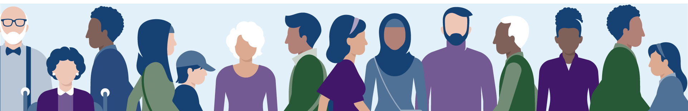

import { Card } from "../../../components/card/src/template";
import { Icon } from "../../../components/icon/src/template";
import evenementImg from "./evenement.png";
import illustratieImg from "./illustratie.PNG";
import thumbnailImg from "./thumbnail.png";

# Beeldkwaliteit

## Fotografie specificaties

**Kleurgebruik**

Alleen fullcolour foto's zijn toegestaan; deze moeten helder en contrastrijk zijn en niet te veel details bevatten.

**Bestandstype**

Gebruik de extensie PNG of JPG bij een foto.

**Bestandsgrootte**

Houd voor gebruik op de website rekening met bestandsgroottes tot 1 MB.

**Kwaliteit**

- De DPI van een foto/afbeelding moet liggen tussen 72–144 dpi.
- Gebruik voor online doeleinden RGB-kleuren, 8 bit.
- Exporteer afbeeldingen voor de website altijd op 100% kwaliteit. Bij het uploaden op de website gaat er namelijk automatisch een compressie van 25% overheen.
- Maak altijd omgevingsfoto's ter registratie. Houd ook rekening met het headerformaat.

**Vakpersartikelen**

Bij vakpersartikelen en praktijkverhalen wordt altijd naar bestaand fotomateriaal gevraagd. Toets deze beelden aan de hand van de richtlijnen of bij een beeldspecialist.

**Website formaten**

- Standaardformaat van een liggende afbeelding: 2400 × 1600 pixels.
- Standaardformaat van een staande afbeelding (inspiratiebalk): 1600 × 2400 pixels.
- Voor een avatar (klein, rond fotootje bij blogs en quotes): 400 × 400 pixels.
- Alleen in het contentelement _Afbeelding_ mag je op de website afwijken van het standaardformaat.
- Aangepast formaat van een liggende afbeelding: qua hoogte niet kleiner dan 1000 pixels (breedte altijd 2400 pixels).
- Aangepast formaat van een staande afbeelding: qua breedte niet kleiner dan 1600 pixels (hoogte altijd 2400 pixels).
- Foto's mogen niet groter zijn dan 1 MB.

**Headerfoto**

- Afmeting: 2400 × 1600 pixels.
- Ondernemer staat centraal, is aan het 'ondernemen' (dus niet passief met armen over elkaar) en kijkt niet in de camera.
- Diversiteit aan mensen.
- Foto's moeten passen bij één of meer van onze 10 hoofdonderwerpen: Klimaat & Energie, Bouwen & Wonen, Internationaal ondernemen, Ontwikkelingssamenwerking, Landbouw, Visserij, Dier & Natuur, Innovatie, Onderzoek & Onderwijs, Ondernemen & Bedrijfsvoering, Gezondheid, Zorg & Welzijn.

## Video specificaties

**Uitgangspunten**

Kies een van de drie uitgangspunten om een herkenbare structuur aan te brengen in de video. RVO adviseert video in eigen beheer te laten produceren. Wanneer dit niet mogelijk is, moeten de auteursrechten zwart op wit geregeld zijn: we hebben toestemming nodig van de auteur van de foto/video.

  

    
Talking head

    <Card
      outline={true}
      padding="lg"
      className="rvo-margin-block-end--sm"
      style={{ display: "flex", justifyContent: "center", alignItems: "center" }}
    >
      <Icon icon="man-hoofd" size="4xl" color="donkerblauw" style={{ "--utrecht-icon-size": "6rem" }} />
    </Card>
    
Pratend persoon als basis

  

  

    
Voice over

    <Card
      outline={true}
      padding="lg"
      className="rvo-margin-block-end--sm"
      style={{ display: "flex", justifyContent: "center", alignItems: "center" }}
    >
      <Icon icon="microfoon" size="4xl" color="donkerblauw" style={{ "--utrecht-icon-size": "6rem" }} />
    </Card>
    
Voice over als basis; video en tekst/animatie ondersteunend.

  

  

    
Muziek

    <Card
      outline={true}
      padding="lg"
      className="rvo-margin-block-end--sm"
      style={{ display: "flex", justifyContent: "center", alignItems: "center" }}
    >
      <Icon icon="geluid-aan" size="4xl" color="donkerblauw" style={{ "--utrecht-icon-size": "6rem" }} />
    </Card>
    
Muziek als basis, alle andere elementen daarop syncen

  

**Ondertiteling**

Let in verband met WCAG/leesbaarheid op het contrast van de ingebrande ondertiteling. Op de website gebruiken we video's met ingebrande ondertiteling. Op andere platforms gebruiken we video's zonder ingebrande ondertiteling; die dient los te worden geüpload, bijvoorbeeld als .srt-bestand. Alle video's dienen in beide varianten te worden aangeleverd. Houd een minimale tekstgrootte van 18 pt en maximaal 22 pt aan. Dit is een functioneel element.

**Kwaliteitsspecificaties**

- 1920 × 1080 (Full HD – 1080p); 720p voor tablets en smartphones.
- Bestandsformaat: mp4 (H.264/H.265).
- Bitrate: 10 Mbps (minimaal 8 Mbps).
- Framerate: 25 fps / 50 fps.
- Bij de stijl 'net iets te scherp': max. 60 fps, resolutie max. 4K.
- Bij de stijl 'depth of field': resolutie max. 4K, framerate max. 30 fps.

**Houd altijd rekening met extra opnamemateriaal:**

- **Snip-its** – Houd in het script rekening met scènes/losse onderdelen die los gebruikt kunnen worden.
- **Omgevingsbeeld** – Maak altijd beeld van de omgeving; dit kan op een later moment van pas komen.
- **Fotografie** – Maak altijd een foto van de hoofdpersoon en omgeving, bijvoorbeeld voor de thumbnail.

**Video met iPhone**

Voor de meeste doeleinden kan de video gemaakt worden met een iPhone. Dit geeft een authentieke uitstraling. Let hierbij op de 'depth of field' waarbij de focus op het hoofdonderwerp mag liggen.

**Publicatie**

Plaats video's altijd in de Rijksbeeldbank. Gebruik hiervoor verschillende versies met en zonder ondertiteling. Het publiceren van een video op YouTube kun je laten doen door een beeldspecialist. Zorg bij het uploaden van de video op de website of YouTube altijd voor een heldere titel, keywords en een passende thumbnail.

## Thumbnail

Breng in de thumbnail de afzender, het onderwerp, de hoofdpersoon en de reeks waar de video deel van uitmaakt in beeld. Zorg ervoor dat de hoofdpersoon er goed op staat.

De thumbnail bestaat uit 4 onderdelen:

  <ol>
    <li>De playlist van de video.</li>
    <li>Van wie de video afkomstig is: bedrijfsnaam / afzender RVO.</li>
    <li>
      De titel van de video. Gebruik enkel een hashtag bij een uniek begrip waarop je gevonden kunt worden in
      zoekresultaten.
    </li>
    <li>
      Denk in reeksen: houd dezelfde stijl aan per playlist. Laat de huisstijlkleuren terugkomen en kies bewust voor
      onderscheidende elementen per reeks.
    </li>
  </ol>
  

## Illustratie en animatie

Illustraties en animaties worden vormgegeven in de rijksbrede illustratiestijl volgens de bijbehorende animatierichtlijnen. Kijk voor het grid en de specifieke richtlijnen op [rijkshuisstijl.nl](https://www.rijkshuisstijl.nl).

  <ul>
    <li>
      <strong>Helder</strong> – Animaties zijn niet te gedetailleerd; niet elk detail hoeft in beeld te komen. Geen
      onnodige vormelementen of stapelingen. Gebruik heldere huisstijlkleuren.
    </li>
    <li>
      <strong>Personen in actie</strong> – Personages staan of zitten niet geposeerd. Richt hun blik op de acties in de
      afbeelding.
    </li>
    <li>
      <strong>Krachtig</strong> – De toon, beelden en sfeer van de animatie zijn in basis serieus (niet onnodig
      grappig), to-the-point en bevatten geen overbodige informatie.
    </li>
    <li>
      <strong>Geloofwaardig</strong> – Personages of objecten worden vormgegeven in de rijksbrede illustratiestijl (geen
      stripfiguren, niet cartoonesk). Zorg voor een goede afspiegeling van de Nederlandse samenleving.
    </li>
    <li>
      <strong>Breed inzetbaar</strong> – Is een thema politiek gevoelig of moeilijk te fotograferen, dan is een
      illustratie bij uitstek geschikt. Illustraties zijn bij uitstek geschikt voor een carrousel op social media. Maak
      deze op als een geheel, zoals een stripverhaal, zodat de kijkrichting automatisch wordt gestuurd naar de volgende
      slide.
    </li>
  </ul>
  

**Animatiestijl**

De animatiestijl is vastgelegd binnen de rijkshuisstijl en gebaseerd op de rijksbrede illustratiestijl. Abstractie en metaforen zijn niet toegestaan. Iconen zijn geen basiselement meer voor animaties. Zorg voor natuurlijke houdingen en bewegingen. Houd de scènes bij een verhaal kort en bondig.

**Video's met motion graphics**

Uitleg- of positioneringsvideo's bevatten grafische elementen om complexe boodschappen simpel uit te leggen. Gebruik een grafische laag ter ondersteuning van een uitleg. Plaats beeld nooit over een gezicht.

**Icoongebruik, illustratie, fotografie**

- Een **icoon** is een kleine, universele grafische weergave die direct een functie, locatie of richting communiceert, bedoeld voor snelle en intuïtieve navigatie.
- Met een **illustratie** is het mogelijk om het specifieke onderwerp uit te lichten en meer context mee te geven.
- **Fotografie** heeft het voordeel dat je situaties kunt vastleggen waarvan je van tevoren niet weet hoe ze eruitzien. Foto's geven soms meer randinformatie dan nodig en kunnen daardoor onbedoeld een sturende boodschap geven.

  

    <Card
      outline={false}
      padding="lg"
      style={{ display: "flex", justifyContent: "center", alignItems: "center", minHeight: "200px" }}
    >
      <Icon icon="hond" size="4xl" color="donkerblauw" style={{ "--utrecht-icon-size": "8rem" }} />
    </Card>
    

      <h4>Iconen</h4>
      <ul>
        <li>Eenvoudig, geabstraheerd</li>
        <li>Cultuur- en taaloverschrijdend door eenvoud en universele symboliek</li>
        <li>Snelbegrip: Eenvoudige, visuele communicatie</li>
      </ul>
    

  

  

    <Card
      outline={false}
      padding="none"
      style={{ overflow: "hidden", minHeight: "200px", display: "flex", alignItems: "center" }}
    >
      
    </Card>
    

      <h4>Illustraties</h4>
      <ul>
        <li>Gestileerd, waarheidsgetrouw</li>
        <li>Reflecteren culturele invloeden en hebben contextspecifieke betekenis</li>
        <li>Visualisatie van situaties, ideeën of concepten</li>
      </ul>
    

  

  

    <Card
      outline={false}
      padding="none"
      style={{ overflow: "hidden", minHeight: "200px", display: "flex", alignItems: "center" }}
    >
      
    </Card>
    

      <h4>Fotografie</h4>
      <ul>
        <li>Natuurlijk, menselijk, echt</li>
        <li>Realistisch, met universele of culturele betekenissen afhankelijk van de context</li>
        <li>Authentieke representaties van de werkelijkheid</li>
      </ul>
    

  

## Infographics

**Bestandstype**

Gebruik bij infographics of illustraties voor de website de extensie SVG. Dit bestandstype zorgt ervoor dat infographics en grafieken scherp tonen en leesbaar zijn op de website. Zorg ervoor dat bij een SVG het font is omgezet naar 'outline' (letteromtrekken). Intern ontwikkelen wij geen interactieve infographics; laat deze rechtstreeks uitbesteden bij een bureau uit de mantelovereenkomst.

**Bestandsgrootte**

Houd voor infographics op de website de bestandsgrootte onder de 2 MB.

**Kwaliteit**

- Maak de infographic altijd op in RGB (kleurprofiel sRGB IEC61966-2.1).
- Exporteer afbeeldingen altijd op 100% kwaliteit.
- Gebruik een minimale tekstgrootte van 38 punten voor leesbaarheid op de website.
- Houd rekening met WCAG: test de contrasten altijd met een contrastchecker.

**Webformaat**

- Aangepast formaat van een liggende afbeelding/infographic: qua hoogte niet kleiner dan 1000 pixels (breedte altijd 2400 pixels).
- Aangepast formaat van een staande afbeelding/infographic: qua breedte niet kleiner dan 1600 pixels (hoogte altijd 2400 pixels).

## Diversiteit

Bekijk per (sub)doelgroep welke soort diversiteit van toepassing is en maak hier een realistische vertegenwoordiging van. Diversiteit omvat verschillende vormen en dimensies die te maken hebben met de unieke eigenschappen, ervaringen en achtergronden van mensen:

### Culturele diversiteit

Verschillen in nationaliteit, etniciteit, taal, en culturele tradities.\
_Bijvoorbeeld: gewoonten, religies, normen en waarden._

### Etnische diversiteit

Variaties in afkomst, raciale kenmerken en etnische groepen.\
_Bijvoorbeeld: Afro-Europese, Aziatische of Latijns-Amerikaanse gemeenschappen._

### Genderdiversiteit

Verschillen in genderidentiteiten en expressies.\
_Bijvoorbeeld: mannen, vrouwen, non-binaire en transgender personen._

### Leeftijdsdiversiteit

Verschillen in leeftijdsgroepen en generaties.\
_Bijvoorbeeld: babyboomers, generatie X, millennials en generatie Z._

### Religieuze en spirituele diversiteit

Verschillen in geloofsovertuigingen en spirituele tradities.\
_Bijvoorbeeld: christendom, islam, hindoeïsme, boeddhisme, atheïsme._

### Fysieke diversiteit

Verschillen in lichamelijke kenmerken en vermogens.\
_Bijvoorbeeld: mensen met een handicap, verschillende lichaamsgroottes, of unieke fysieke kenmerken._

### Professionele diversiteit

Verschillen in beroepservaring, sectoren en vaardigheden.\
_Bijvoorbeeld: technische beroepen, creatieve sectoren, gezondheidszorg._

## Juridisch

**Portretrecht**

Een quitclaim is een overeenkomst tussen fotograaf en model waarin de geportretteerde toestemming geeft voor de gemaakte beelden en afziet van zijn of haar portretrecht. Het quitclaimformulier is op te vragen via je beeldspecialist. Bij evenementen kan de host vooraf een aankondiging doen waarbij mensen die niet willen worden vastgelegd, zich kunnen melden.

**Auteursrecht**

De maker van de foto moet in alle gevallen toestemming hebben gegeven voor publicatie. Beeldspecialisten in dienst van RVO wordt dit ondervangen middels een contract. Ondernemers of externe fotografen kunnen de gebruiksrechten overdragen aan RVO middels het formulier 'overdracht gebruiksrecht'. Neem voor het passende formulier contact op met een beeldspecialist of [beeld@rvo.nl](mailto:beeld@rvo.nl).

- Let altijd op dat er geen bekend ontwerp, kunstwerk of persoon in beeld staat.
- Vermeld bij gebruik van beeld van een auteur buiten de organisatie altijd een naam bij de bron.

**Vakpersartikelen en praktijkverhalen**

Wij werken (sinds 2025) met het akkoordenformulier: geïnterviewden geven toestemming op het publiceren van de door hen aangeleverde foto's en op de tekst.

- Beeldspecialisten beheren het akkoordenformulier.
- Beeldspecialisten beheren de aangeleverde foto's van praktijkverhalen in de Beeldbibliotheek van RVO (in Drupal) en/of de Mediatheek van de Rijksoverheid.

**RVO content delen**

RVO beeld mag gedeeld worden mits de context is afgestemd met de verantwoordelijke contentadviseur en met vermelding van RVO als bron. Op de website vermelden wij de naam van de fotograaf.

## WCAG

Houd rekening met de volgende toegankelijkheidsgroepen:

- **Visueel**: blind, slechtziend, kleurenblind
- **Auditief**: doof, slechthorend, gehoorschade
- **Motorisch**: spierziekte, RSI
- **Cognitief**: autisme, epilepsie, laaggeletterd, dyslexie

**1. Contrast**

- Zorg voor voldoende contrast tussen tekst en achtergrond. Het minimale contrastniveau is 4,5:1 voor normale tekstgrootte (12–14 pt).
- En 3:1 voor grote tekst (18 px vetgedrukt).
- Gebruik een contrastchecker om het contrast in je visual te controleren (het contrast is goed als er AA of AAA uitkomt).

**2. Kleurgebruik**

Gebruik kleur niet als enige middel om informatie over te brengen; voeg extra visuele signalen toe zoals symbolen of tekst.

**3. Tekstalternatieven**

- Geef beschrijvende en duidelijke alternatieve teksten voor afbeeldingen zodat deze kunnen worden voorgelezen.
- Als de afbeelding decoratief is, gebruik dan een lege alt-tekst (`alt=""`).

**4. Responsief ontwerp**

Zorg ervoor dat visuals goed schaalbaar zijn, zodat ze op alle apparaten toegankelijk zijn (tablet, desktop, mobiel).

**5. Animatie en video's**

- Voeg een audiobeschrijving toe bij video's met belangrijke visuele elementen.
- Vermijd knipperende of flitsende elementen (max. 3 per seconde).
- Spraak en muziek tegelijk is enkel mogelijk mits de muziek op het moment van spreken op minimale frequentie naar de achtergrond wordt verplaatst.

**6. Structuur en hiërarchie**

Gebruik een duidelijke lay-out, knoppen en hoofd- en subonderwerpen om visuele content logisch te organiseren. Maak gebruik van een visuele hiërarchie door middel van grootte, vetgedrukte tekst en kleur.

**7. Infographics en visuals in PDF**

- Borg de toegankelijkheid in het bronbestand.
- Plaats bij de downloadlink van de pdf een korte samenvatting/intro.
- Geef een alternatief, bijvoorbeeld in de vorm van een html-variant.
