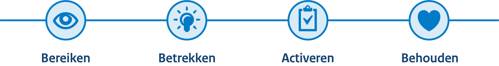

# Aanspreken van doelgroepen

1. **Identificeer je belangrijkste doelgroep(en)**

   - Wat vinden zij belangrijk; wat motiveert hen en waar liggen de pijnpunten?
   - Wat zijn thema's die hen aanspreken?
   - Breng je een nieuw thema in beeld? Toets dit altijd eerst bij de juiste stakeholders binnen RVO.

2. **Kies de juiste beelduiting** – bijvoorbeeld fotografie, illustratie of een videoformat.

   - Gebruik kleuren (binnen de huisstijl) die aansluiten bij de associaties van de doelgroep.
   - Zorg dat de beelden authentiek zijn en passen bij de doelgroep; vermijd clichébeelden en zorg voor de diversiteit in beeld die op jouw doelgroep van toepassing is.

3. **Kies de juiste kanalen en formaten**

   - Identificeer waar de doelgroep zich bevindt (social media, de website, etc.).
   - Optimaliseer de beelden voor dit platform (resolutie, context, afmetingen).
   - Bepaal eventueel een doel m.b.t. het bereik.
   - Gebruik storytelling die interactie stimuleert.

4. **Toets je beelden bij een aantal personen uit je doelgroep**

   - Pas je beelden aan op basis van feedback.

5. **Publiceer en monitor resultaten**
   - Borg beelden op de juiste manier; voeg de juiste gegevens en quitclaim toe bij plaatsing in de mediatheek en op YouTube.
   - Monitor de betrokkenheid en interactie; interpreteer dit op basis van gestelde doelen.

## Beeldgebruik in klantreis

> Een gemiddelde persoon scrollt 92 meter aan content per dag. – LinkedIn

Daarom is het belangrijk om op de juiste manier en het juiste moment zichtbaar te zijn.

In de volgende tabellen zijn voorbeelden te zien van verschillende beelduitingen die aansluiten op de fasen in de klantreis.

### Bereiken

Nieuwe doelgroepen aanspreken, merkbekendheid creëren. 
_Kort, opvallend, deelbaar._

  <table className="rvo-table">
    <thead className="rvo-table-head">
      <tr className="rvo-table-row">
        <th scope="col" className="rvo-table-header">
          Beelduiting
        </th>
        <th scope="col" className="rvo-table-header">
          Omschrijving
        </th>
        <th scope="col" className="rvo-table-header">
          Platform
        </th>
      </tr>
    </thead>
    <tbody>
      <tr className="rvo-table-row">
        <td className="rvo-table-cell">Carrousels/sliders</td>
        <td className="rvo-table-cell">Meerdere visuals in één post om een verhaal te vertellen (storytelling)</td>
        <td className="rvo-table-cell">Instagram, LinkedIn, Facebook</td>
      </tr>
      <tr className="rvo-table-row">
        <td className="rvo-table-cell">Infographics</td>
        <td className="rvo-table-cell">Duidelijke en beknopte informatie in een visueel aantrekkelijke stijl</td>
        <td className="rvo-table-cell">LinkedIn, Instagram</td>
      </tr>
      <tr className="rvo-table-row">
        <td className="rvo-table-cell">GIFs</td>
        <td className="rvo-table-cell">Duidelijke en beknopte informatie in een visueel aantrekkelijke stijl</td>
        <td className="rvo-table-cell">Instagram</td>
      </tr>
      <tr className="rvo-table-row">
        <td className="rvo-table-cell">Banners (online en offline)</td>
        <td className="rvo-table-cell">Opvallende advertenties (met korte call to actions)</td>
        <td className="rvo-table-cell">YouTube, Instagram, Facebook, website</td>
      </tr>
      <tr className="rvo-table-row">
        <td className="rvo-table-cell">Fotografie met ondernemer centraal</td>
        <td className="rvo-table-cell">Foto's waarin de doelgroep zich herkent</td>
        <td className="rvo-table-cell">LinkedIn, Instagram, Facebook, website</td>
      </tr>
      <tr className="rvo-table-row">
        <td className="rvo-table-cell">Reels en Shorts</td>
        <td className="rvo-table-cell">Korte en snelle video's 10–30 sec</td>
        <td className="rvo-table-cell">Instagram Reels, YouTube Shorts, Facebook Reels</td>
      </tr>
      <tr className="rvo-table-row">
        <td className="rvo-table-cell">Korte video's</td>
        <td className="rvo-table-cell">Inspirerende en verhalende video's 30 sec</td>
        <td className="rvo-table-cell">Instagram, Facebook, YouTube, LinkedIn</td>
      </tr>
    </tbody>
  </table>

### Betrekken

Interactie stimuleren en interesse wekken; ondernemers laten kennismaken en hun interesse vergroten. 
_Informatief, storytelling, interactief._

  <table className="rvo-table">
    <thead className="rvo-table-head">
      <tr className="rvo-table-row">
        <th scope="col" className="rvo-table-header">
          Beelduiting
        </th>
        <th scope="col" className="rvo-table-header">
          Omschrijving
        </th>
        <th scope="col" className="rvo-table-header">
          Platform
        </th>
      </tr>
    </thead>
    <tbody>
      <tr className="rvo-table-row">
        <td className="rvo-table-cell">How-to Infographics</td>
        <td className="rvo-table-cell">Stap-voor-stap uitleg met visuals</td>
        <td className="rvo-table-cell">Instagram, LinkedIn, website</td>
      </tr>
      <tr className="rvo-table-row">
        <td className="rvo-table-cell">Behind-the-scenes foto's &amp; stories</td>
        <td className="rvo-table-cell">
          Persoonlijke content vanuit de ondernemer of vanuit RVO (bijvoorbeeld mbt processen en ervaringen)
        </td>
        <td className="rvo-table-cell">Instagram (Stories), Facebook (Stories)</td>
      </tr>
      <tr className="rvo-table-row">
        <td className="rvo-table-cell">Carroussels/sliders</td>
        <td className="rvo-table-cell">Meerdere visuals in één post om een verhaal te vertellen (storytelling)</td>
        <td className="rvo-table-cell">Instagram, LinkedIn, Facebook</td>
      </tr>
      <tr className="rvo-table-row">
        <td className="rvo-table-cell">Korte animaties/gifs</td>
        <td className="rvo-table-cell">Korte uitleg video's</td>
        <td className="rvo-table-cell">Instagram, LinkedIn, YouTube Shorts</td>
      </tr>
      <tr className="rvo-table-row">
        <td className="rvo-table-cell">Bondige infographics</td>
        <td className="rvo-table-cell">Heldere uitleg van processen</td>
        <td className="rvo-table-cell">Website, publicaties, Instagram, LinkedIn, Facebook</td>
      </tr>
      <tr className="rvo-table-row">
        <td className="rvo-table-cell">Opvallende korte video reeksen</td>
        <td className="rvo-table-cell">Educatieve en informatieve video's 30 sec – 3 min</td>
        <td className="rvo-table-cell">Website, YouTube, LinkedIn, Instagram, Facebook</td>
      </tr>
      <tr className="rvo-table-row">
        <td className="rvo-table-cell">Korte films</td>
        <td className="rvo-table-cell">Langere video's met een dynamische storyline 30–45 minuten</td>
        <td className="rvo-table-cell">YouTube</td>
      </tr>
    </tbody>
  </table>

### Activeren

Mensen aansporen tot actie. 
_Vertrouwen opbouwen, demonstreren, call to actions._

  <table className="rvo-table">
    <thead className="rvo-table-head">
      <tr className="rvo-table-row">
        <th scope="col" className="rvo-table-header">
          Beelduiting
        </th>
        <th scope="col" className="rvo-table-header">
          Omschrijving
        </th>
        <th scope="col" className="rvo-table-header">
          Platform
        </th>
      </tr>
    </thead>
    <tbody>
      <tr className="rvo-table-row">
        <td className="rvo-table-cell">Korte activerende video</td>
        <td className="rvo-table-cell">Korte en krachtige uitleg waarom actie nodig is</td>
        <td className="rvo-table-cell">Website</td>
      </tr>
      <tr className="rvo-table-row">
        <td className="rvo-table-cell">Carroussels/sliders</td>
        <td className="rvo-table-cell">
          Meerdere visuals in één post met een duidelijke call to action (en uitleg waarom deze nodig is)
        </td>
        <td className="rvo-table-cell">LinkedIn en Facebook</td>
      </tr>
      <tr className="rvo-table-row">
        <td className="rvo-table-cell">Infographics</td>
        <td className="rvo-table-cell">
          Overzichtelijke datavisualisaties met trends &amp; analyses, stappenplannen of visuele uitleg van
          kernboodschappen
        </td>
        <td className="rvo-table-cell">Carousselposts op LinkedIn en Facebook, vakbladen, publicaties, website</td>
      </tr>
      <tr className="rvo-table-row">
        <td className="rvo-table-cell">Korte animaties &amp; Gifs</td>
        <td className="rvo-table-cell">Speelse, subtiele aandachtstrekkers die een call to action versterken</td>
        <td className="rvo-table-cell">Website, Facebook, Instagram</td>
      </tr>
      <tr className="rvo-table-row">
        <td className="rvo-table-cell">Klantverhalen met portret foto's</td>
        <td className="rvo-table-cell">Verhalen van echte ondernemers en hun ervaringen</td>
        <td className="rvo-table-cell">Publicaties, vakbladen, Instagram, LinkedIn, Facebook</td>
      </tr>
      <tr className="rvo-table-row">
        <td className="rvo-table-cell">Illustraties en iconen</td>
        <td className="rvo-table-cell">Ter ondersteuning bij langere teksten of complexe uitleg</td>
        <td className="rvo-table-cell">Website, publicaties, vakbladen, LinkedIn en Facebook berichten</td>
      </tr>
      <tr className="rvo-table-row">
        <td className="rvo-table-cell">Fotografie met ondernemer centraal</td>
        <td className="rvo-table-cell">Foto's waarin de doelgroep zich herkent</td>
        <td className="rvo-table-cell">LinkedIn, Instagram, Facebook, website</td>
      </tr>
      <tr className="rvo-table-row">
        <td className="rvo-table-cell">Registratie en omgevingsfotografie</td>
        <td className="rvo-table-cell">
          Ter verduidelijking van een specifiek onderwerp, ondersteuning van een fotoreeks met ondernemers
        </td>
        <td className="rvo-table-cell">Website, publicaties, vakbladen</td>
      </tr>
    </tbody>
  </table>

### Behouden

Relaties onderhouden; wijzen op andere diensten. 
_Persoonlijk, interactief, waardevol._

  <table className="rvo-table">
    <thead className="rvo-table-head">
      <tr className="rvo-table-row">
        <th scope="col" className="rvo-table-header">
          Beelduiting
        </th>
        <th scope="col" className="rvo-table-header">
          Omschrijving
        </th>
        <th scope="col" className="rvo-table-header">
          Platform
        </th>
      </tr>
    </thead>
    <tbody>
      <tr className="rvo-table-row">
        <td className="rvo-table-cell">Exclusieve video content voor bestaande klanten</td>
        <td className="rvo-table-cell">Korte video's over specifieke onderwerpen en sfter video's 1–3 minuten</td>
        <td className="rvo-table-cell">Instagram, Facebook, YouTube, e-mailmarketing</td>
      </tr>
      <tr className="rvo-table-row">
        <td className="rvo-table-cell">Specifieke visuals</td>
        <td className="rvo-table-cell">Terugkerende illustraties</td>
        <td className="rvo-table-cell">
          Nieuwsbrieven, website (en klantportaal), organische posts op Instagram, Facebook, LinkedIn
        </td>
      </tr>
      <tr className="rvo-table-row">
        <td className="rvo-table-cell">Omgevings(evenement)fotografie</td>
        <td className="rvo-table-cell">Verslaglegging van een bepaalde gebeurtenis of evenement</td>
        <td className="rvo-table-cell">
          Community groepen op Instagram, LinkedIn, Facebook, e-mailmarketing, nieuwsbrieven
        </td>
      </tr>
      <tr className="rvo-table-row">
        <td className="rvo-table-cell">'Behind the scenes' verhalen</td>
        <td className="rvo-table-cell">
          Video's die laten zien hoe RVO te werk gaat of hoe het gaat bij een ondernemer
        </td>
        <td className="rvo-table-cell">Website, LinkedIn, Instagram, YouTube, Facebook</td>
      </tr>
      <tr className="rvo-table-row">
        <td className="rvo-table-cell">Infographics en datavisualisatie</td>
        <td className="rvo-table-cell">Impact, resultaten, trends en gedeelde successen</td>
        <td className="rvo-table-cell">Website, LinkedIn, Facebook, publicaties, vakbladen</td>
      </tr>
      <tr className="rvo-table-row">
        <td className="rvo-table-cell">Korte animaties en Gifs</td>
        <td className="rvo-table-cell">Subtiele animatie die betrokkenheid stimuleert</td>
        <td className="rvo-table-cell">Website, Instagram, Facebook</td>
      </tr>
      <tr className="rvo-table-row">
        <td className="rvo-table-cell">Portretfotografie bij klantverhalen</td>
        <td className="rvo-table-cell">Echte foto's van tevreden klanten met klantervaringen en quotes</td>
        <td className="rvo-table-cell">Vakbladen, publicaties, Instagram Stories, LinkedIn, Facebook</td>
      </tr>
    </tbody>
  </table>

## Beeldrecht

- Wij maken geen gebruik van stockfotografie en AI-gegenereerd beeld in externe communicatie.
- Op foto's, afbeeldingen, video's en teksten zit automatisch auteursrecht, ook wel copyright. In de Auteurswet staat dat alleen de maker die werken mag publiceren en vermenigvuldigen. Auteursrecht op stockfotografie betekent dat de fotograaf de maker en eigenaar blijft, terwijl de gebruiker via een stocksite een licentie (gebruiksrecht) koopt. Je koopt nooit de foto zelf, maar meestal tijdelijke toestemming voor specifiek gebruik (commercieel of redactioneel).
- Stockfotosites kunnen niet garanderen dat de plaatser de auteur is en dat er afspraken zijn met de auteur.
- RVO kan de licentievoorwaarden niet gegarandeerd nakomen (deze kunnen verschillen per site of afbeelding).
- Fotoclaims worden verhaald op het budget van het betreffende communicatieteam.
- Gebruik bij herkenbare personen in beeld altijd een quitclaim.
- Vraag bij evenementen vooraf wie er niet op de foto wil en voorzie deze personen van een felgekleurde sticker.
