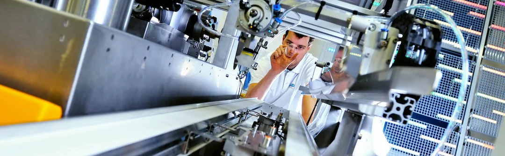
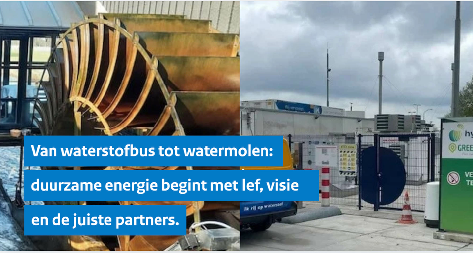
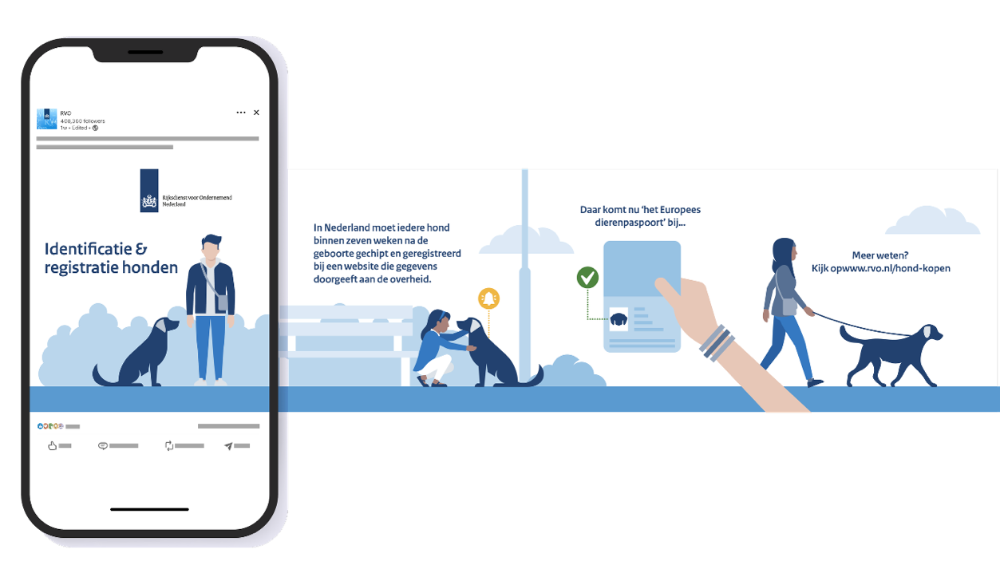

import { Icon } from "@nl-rvo/component-library-react";
import evenementImg from "./evenement.png";
import fout1Img from "./fout-1.jpg";
import fout2Img from "./fout-2.png";
import omgevingsbeeldImg from "./omgevingsbeeld.jpg";
import onderwerpInBeeldImg from "./onderwerp-in-beeld.png";
import registratieImg from "./registratie.png";

# Herkenbaarheid

Herkenning ontstaat na 6 keer herhaling. Om als afzender herkenbaar te zijn is consistentie in kleur, uitstraling, vormtaal, typografie en concept essentieel.

> Mensen scannen beelden 60.000× sneller dan tekst; beeld bepaalt je eerste indruk.

## Beeldvorming

Beeldvorming ontstaat heel snel, het lezen van een beeld gebeurt in 3 seconden. Zie hieronder de fasen van beeldvorming:

**Fase 1: Eerste herkenning binnen 0,013 seconden**

Onderzoek van o.a. MIT (Potter et al., 2014) toont aan dat mensen een beeld al in 13 ms globaal kunnen categoriseren (bijv. "er staat een dier op"). Dit is pre-bewuste, snelle visuele verwerking.

**Fase 2: Eerste fixatie en betekenis binnen 0,1 à 0,3 seconden**

Waarbij 50–80% van de totale kijktijd in portretbeelden naar het gezicht gaat. Eye-trackingonderzoek (o.a. aan de Universiteit Leiden) laat zien dat ogen vaak binnen 200–300 milliseconden als eerste fixatiepunt worden gekozen. Dit hangt samen met onze sociale informatieverwerking: ogen verschaffen directe informatie over intentie, emotie en richting van aandacht.

**Fase 3: Bliksturing binnen 0,15 à 0,3 seconden**

Het gaze cueing-effect (Friesen & Kingstone, 1998; Driver et al., 1999) laat zien dat mensen binnen ongeveer 150–300 milliseconden automatisch hun aandacht verplaatsen in de richting waar een afgebeelde persoon naar kijkt. Wanneer de afgebeelde persoon iets in de handen heeft, verplaatst de blik zich in tweede plaats daarnaartoe.

**Fase 4: Emotionele interpretatie binnen 0,5 à 1 seconde**

Binnen ongeveer een halve seconde wordt emotie herkend, de sociale intentie geïnterpreteerd en ontstaat het waardeoordeel (positief/negatief, betrouwbaar/onduidelijk).

**Fase 5: Bewuste interpretatie binnen 1 à 3 seconden**

Binnen enkele seconden wordt de scène actief begrepen en de context gekoppeld. Na 3 seconden is de kernboodschap meestal gevormd.

Houd om deze reden de volgende richtlijn aan:

- Maak binnen 0,3 seconde duidelijk waar de aandacht naartoe moet.
- Maak het beeld binnen 1 seconde relationeel of emotioneel relevant.
- Zorg dat het beeld binnen 3 seconden inhoudelijk begrijpelijk is.

## Kijkrichting

Een duidelijke blikrichting, zichtbare ogen en actiebeeld werken sterk: zij versnellen zowel aandacht als interpretatie. Zorg voor een duidelijke kijkrichting om de boodschap zo helder en toegankelijk mogelijk te maken. Houd de beelden mensgericht, kies voor een duidelijke blik op een bepaald onderwerp en zorg ervoor dat de persoon bezig is met de handen.

Maak hier gebruik van en let op:

1. **Ogen en blikrichting** – Kijkt de persoon je aan? Dan adresseer je iets; dit kan een emotie zijn maar ook indringend of hiërarchisch overkomen. Gebruik dit beeld enkel bij een oproep aan je doelgroep.
2. **Handen en actie** – Zorg dat de persoon iets aan het doen is met de handen; voorkom geposeerd beeld.
3. **Omgeving** – Zorg voor zo min mogelijk ruis en een duidelijke context.

## Kenmerkend beeld

### Ondernemer centraal

We kiezen voor een duidelijk uitgangspunt in onze beelden en zetten de ondernemer centraal.

  
  

    <h4>Ondernemer/ onderwerp in beeld</h4>
    

      De ondernemer is de expert binnen het vakgebied. Zet de ondernemer en zijn/haar expertise centraal. Gebruik echte
      ondernemers en laat de ondernemer aan het werk zien. Is dit niet mogelijk? Dan kan het ook indirect – door de
      invloed of resultaten van de ondernemer te laten zien. Zorg voor een opgeruimde omgeving.
    

  

### Uitzonderingen op ondernemer

  
  

    <h4>Registratiefotografie</h4>
    

      Waarbij een specifiek onderwerp centraal staat (zoals een plant- of diersoort) is enkel het onderwerp in beeld.
      Gebruik dit enkel ter illustratie, als uitleg om welk type onderwerp (dier, product, machine, etc.) het gaat.
    

  

  
  

    <h4>Omgevingsfotografie</h4>
    

      Neem altijd een aantal foto's van de omgeving. Dit type foto kan worden ingezet ter ondersteuning van de
      hoofdbeelden en schept sfeer. Gebruik dit niet als hoofdfoto, maar laat je foto een verhaal vertellen.
    

  

  
  

    <h4>Evenementfotografie</h4>
    

      Zorg ervoor dat er interactie is tussen het publiek en leg mensen vast in actie in plaats van statische
      opstellingen.
    

  

### Richtlijnen

**Perspectief**

Foto's worden vanuit een natuurlijk perspectief gemaakt. Maak waar mogelijk gebruik van het perspectief op ooghoogte of kikkerperspectief zodat je niet neerkijkt op de persoon in beeld. Voorkom een hiërarchische uitstraling.

**Verhalend**

Laat duidelijk zien wat je wilt vertellen. Het beeld dient de bijbehorende communicatieboodschap te versterken. Bedenk waar de ondernemer aan denkt terwijl de foto gemaakt wordt en houd rekening met de kijkrichting. Zorg voor een duidelijke link met de omgeving via een voorwerp (een schep, een product, een pen, een drone). Denk niet in één enkel plaatje maar aan het geheel. Is het niet haalbaar om de boodschap in één beeld te vangen? Dan is het effectiever je verhaal met meer beelden te ondersteunen – denk in een reeks of in een panorama.

**Scherptediepte**

Gebruik scherptediepte om een duidelijke focus aan te brengen op het onderwerp, het product of de omgeving.

**Actie en vooruitgang**

Gebruik zoveel mogelijk het handelingsperspectief: laat zien waarmee de ondernemer bezig is. Letterlijke bewegingen zijn goed vast te leggen met een lange sluitertijd. Gebruik actueel beeld en leg het meest interessante moment vast.

**Clichébeeld**

Zoek naar een interessant moment om de ondernemer vast te leggen. Vermijd clichébeelden, zoals beeld van de Eiffeltoren wanneer het over ondernemen in Frankrijk gaat. Houd rekening met de diversiteit van de doelgroep – denk aan meer soorten diversiteit dan huidskleur – en houd het realistisch. Maak het beeld persoonlijk en toets het concept bij je doelgroep.

**Positief**

Gebruik beeld dat aansluit op de inhoud. Richt je op positieve situaties en inspireer de doelgroep met goede voorbeelden. Laat zien wat er waardevol is aan de inzet van de ondernemer. Positief beeld motiveert.

**Geloofwaardig**

Beelden zijn realistisch en dus niet overduidelijk geënsceneerd. Breng mensen in beeld zoals ze echt zijn. Collages en zichtbare beeldbewerkingen zijn niet toegestaan. Foto's mogen ook met een goede telefoon zijn gemaakt. Voorkom over-gestyleerd beeld.

**Nederlands en Nederland in het buitenland**

Wanneer het onderwerp gaat over Nederland of zich afspeelt in Nederland, gebruik dan Nederlandse beelden. Houd rekening met de diversiteit van mensen binnen de doelgroep.

  

    
    
      <Icon icon="kruis" size="4xl" color="" style={{ "--utrecht-icon-size": "14rem", color: "#d52b1e" }} />
    
  

  

    
    
      <Icon icon="kruis" size="4xl" color="" style={{ "--utrecht-icon-size": "14rem", color: "#d52b1e" }} />
    
  

